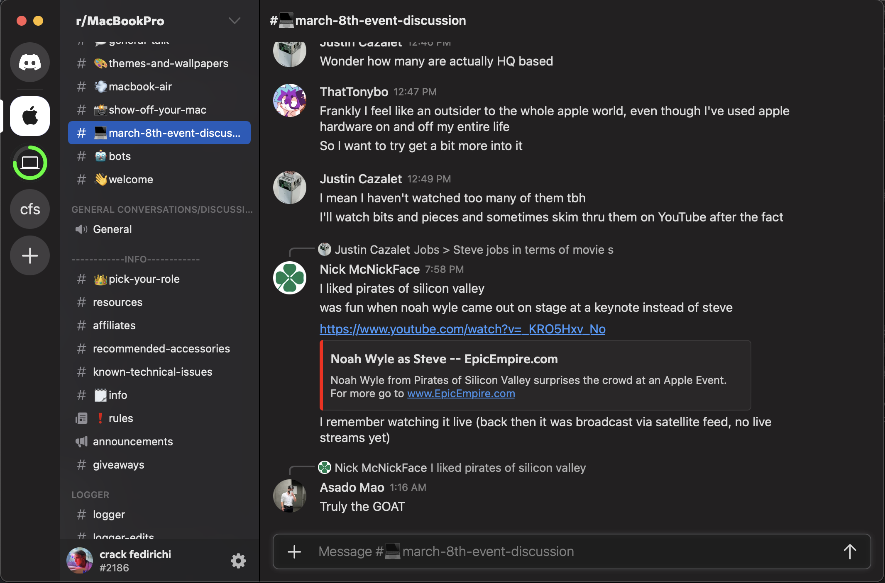
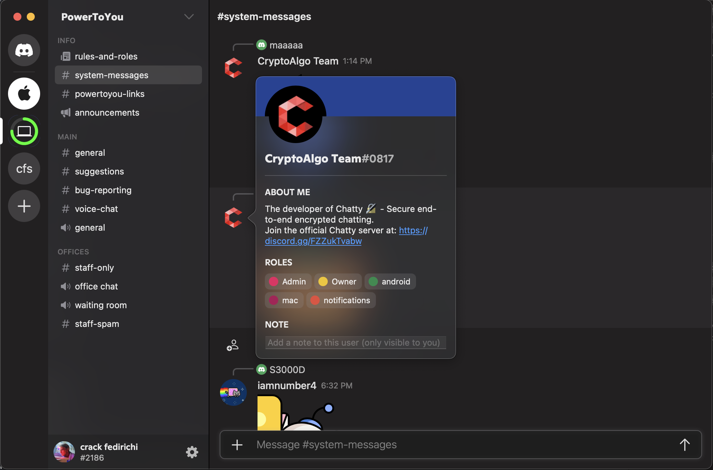

# Swiftcord

> A completely native Discord client for macOS built 100% in
> Swift and SwiftUI

This project aims to create a fully functional native Discord
client in Swift for macOS from scratch. Look [below](#screenshots) for
a bunch of screenshots!

**If you like this project, please give it a ⭐ star! It helps motivate
me to continue developing it**

### Pre-built packages are now available at [releases](https://github.com/cryptoAlgorithm/Swiftcord/releases/latest)!

### Join the Swiftcord Discord server [here](https://discord.gg/he7n6MGDXS)!

## Client Feature Parity

Feature parity with the following Discord client is targeted:

| Version         | `0.0.283`|
| --------------- | -------- |
| Build #         | `115689` |
| Release Channel | `canary` |

## Current State

Implemented most core message-related features from the official
client, including basic markdown and embeds, stickers (lottie/PNG),
editing and deleting events. Token retrival from Discord login 
page is reliable and storing + retrival from keychain works.

Gateway connection and event handling is stable, but reconnection
is not. Reconnection/resuming might not be successful when internet
connection is unstable or macOS has been sleeping for a very long time.

## Milestones/Roadmap

- ✅ Gateway/REST API Implementation
- ✅ Load server list, channels and message
- ✅ Basic message, channel and server rendering
- ✅ Rich message rendering (stickers, embeds, markdown, media)
- ✅ Message replies
- ✅ Load and display full user profile (bio + roles)
- ✅ Save last server and last channel viewed in servers (QoL)
- ✅ Better loading screen
- ✅ Find and request most optimised photo size from CDN
- ⏱ Partial user and app settings
- ✅ DM and group loading
- ⏱ Display DMs properly in UI
- ⏱ Send DM messages
- ❌ User roles + overwrites
- ❌ Message notifications
- ❌ Full list of users in a server, especially for larger servers (1000+ members)
- ❌ Ordering of channels, servers and categories
- ❌ Threads support
- ❌ Full user settings
- ❌ Server creation
- ❌ Server discovery
- ❌ Server banner, boost widget and other misc. boosted features
- ❌ Voice channels (ambitious)
- ❌ Video channels (very ambitious)

#### Legend: 
* ✅ -> Complete
* ⏱ -> Implementation in progress
* ❌ -> Not started

## Screenshots

#### General messages with replies

#### Rich embeds sent by a webhook

#### Channel with welcome message and animated stickers

#### User profile popover

#### Loading screen

#### Login flow (video)

## Contributions

Thank you for popping by! If you know the Discord API well, 
have Swift knowledge and feel like contributing, feel free to
make a pull request! Any (positive) contribution is welcome,
no matter how small!

Found an issue? Ensure it isn't a duplicate, then open a new issue
with the appropriate template and fill in the placeholders as
clearly as you can. Responding promptly to follow up comments
is appreciated, as debugging is hard without any further input
from the OP.

## License

Made with ❤️ by Vincent Kwok

Copyright © 2022 Vincent Kwok

This program is free software: you can redistribute it and/or
modify it under the terms of the GNU General Public License as
published by the Free Software Foundation, either version 3 of
the License, or (at your option) any later version.

This program is distributed in the hope that it will be useful,
but WITHOUT ANY WARRANTY; without even the implied warranty of
MERCHANTABILITY or FITNESS FOR A PARTICULAR PURPOSE.  See the
GNU General Public License for more details.

See <https://www.gnu.org/licenses/> or LICENSE for a copy of
the GNU General Public License.
