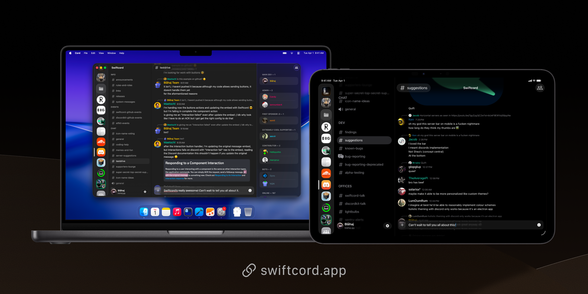

<h1 align="center">Swiftcord</h1>

The 100% native SwiftUI macOS Discord client, now with Liquid Glass.
 
Join the waitlist at <a href="https://swiftcord.app">swiftcord.app</a> to be the first in line for early access!
 

  

  

## Simply beautiful.
Swiftcord looks and feels like a natural part of your Mac and iPad. Smooth animations, familiar controls, and meticulous attention to detail. It just feels right.

## Blazingly fast.
Rebuilt from the ground up with performance at its core, Swiftcord launches in an instant,
moves effortlessly between conversations, and stays remarkably light on your system.

## Open Source
Swiftcord is under heavy development and is not currently accepting external contributions.
Source code will be made available following the public release.
