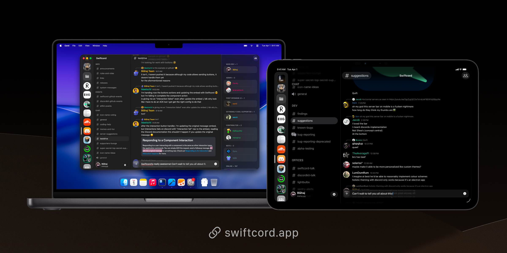

<h1 align="center">Swiftcord</h1>

  The 100% native SwiftUI macOS Discord client, now with Liquid Glass.
    
  
  

  

## Simply beautiful.
Swiftcord looks and feels like a natural part of your Mac and iPad with meticulous attention
to detail. Built in SwiftUI, it uses system controls while ensuring messages, rich text, and
embeds look exactly like you expect.

## Blazingly fast.
Rebuilt from the ground up with performance at its core, Swiftcord launches in an instant,
moves effortlessly between conversations, and stays remarkably light on your system.

## [Download Now!](https://swiftcord.app/download)
Currently available for macOS 26+, Apple Silicon. iOS coming soon.

Follow along on X and Discord for updates. Plus, chat directly with developers and other awesome community members! 

  &nbsp;
  

> Note: Looking for the legacy codebase? It's archived at the `main` branch.
